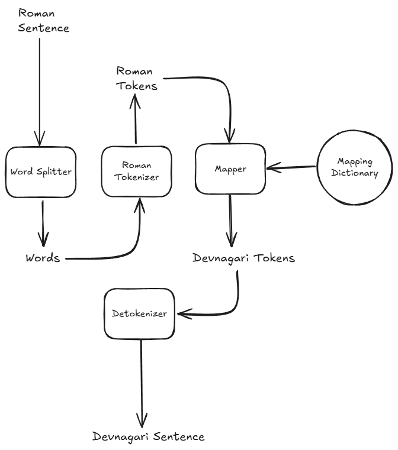

# Simple Transliteration Library (English to Devanagari)

This is a small Python library to convert English (Romanized Nepali) words into Devanagari script.  
It uses a mapping of words and letters to transliterate the text.

## What this project does

- You give English letters or words like `mero naam sita ho`
- It gives back Devanagari output like `मेरो नाम सिता हो`

## Requirements

- Python 3.x
- Terminal (Command Line)

## How to use

1. Clone this repo
2. Open terminal and go to the `src` folder
3. Run the program: `python main.py`
4. Start typing any sentence like `mero naam sita ho`
5. You will see output like: `मेरो नाम सिता हो`
6. To exit, press Enter on empty input or type `quit` and hit enter

## Note

This program is not 100% accurate. Some words may be transliterated wrong.  
It can be improved by adding more mappings in `mapping.json`.

## Architecture Diagram

